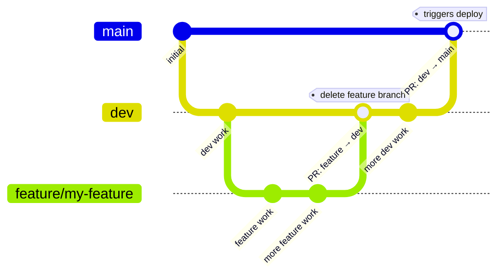

# Development Guide

## Live site

Hosted on **GitHub Pages**: <https://ejamer.github.io/hugo-testing/>

Pushing to `main` triggers the GitHub Actions workflow (`.github/workflows/hugo.yml`), which builds with Hugo and deploys automatically.

---

## Branch strategy

| Branch | Purpose |
|--------|---------|
| `main` | Production — every push triggers a Pages deploy. **Never commit directly to `main`.** |
| `dev` | Permanent development branch. All work lands here first. **Never delete.** |
| `feature/*` | Short-lived branches cut from `dev` for larger features. Delete after the PR into `dev` is merged. |

### Branch structure



### Feature development flow


1. Cut a feature branch from `dev` (or work directly in `dev` for small changes).
2. Develop and test locally.
3. Push the feature branch and open a PR into `dev`. Merge and delete the feature branch.
4. When `dev` is ready to release, open a PR from `dev` into `main`. The Actions job deploys on merge.

---

## Local development

Hugo is installed via snap (`/snap/bin/hugo`). Run all commands from `fenb-1/`.

```bash
cd fenb-1

# Dev server — live reload, search won't work
/snap/bin/hugo server

# Dev server with search working (writes public/ to disk first)
/snap/bin/hugo && npx pagefind --site public && /snap/bin/hugo server --renderStaticToDisk

# Production build (output → fenb-1/public/)
/snap/bin/hugo --environment production && npx pagefind --site public
```

The site builds in ~100 ms.

### Search index

Pagefind runs as a post-build step and writes its index to `public/pagefind/`. This directory is **not tracked in git** — regenerate it after every build. The search overlay lazy-loads Pagefind's JS/CSS on first use, so `/pagefind/` must exist before serving.
