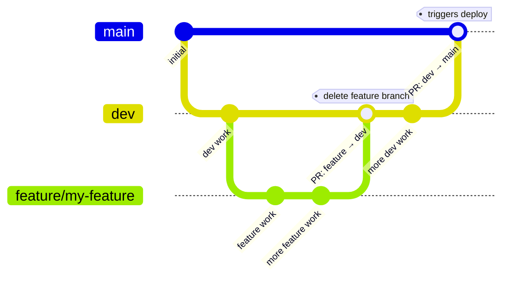
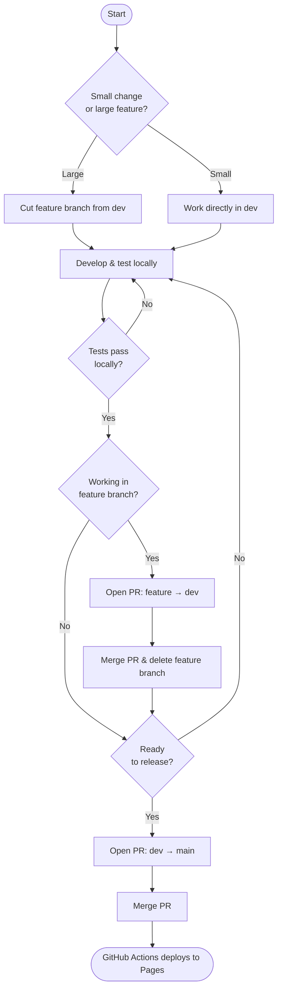

# Development Guide

## Live site

Hosted on **GitHub Pages**: <https://ejamer.github.io/hugo-testing/>

Pushing to `main` triggers the GitHub Actions workflow (`.github/workflows/hugo.yml`), which builds with Hugo and deploys automatically.

---

## Branch strategy

| Branch | Purpose |
|--------|---------|
| `main` | Production — every push triggers a Pages deploy. **Never commit directly to `main`.** |
| `dev` | Permanent development branch. All work lands here first. **Never delete.** |
| `feature/*` | Short-lived branches cut from `dev` for larger features. Delete after the PR into `dev` is merged. |

### Branch structure



### Feature development flow



1. Cut a feature branch from `dev` (or work directly in `dev` for small changes).
2. Develop and test locally.
3. Push the feature branch and open a PR into `dev`. Merge and delete the feature branch.
4. When `dev` is ready to release, open a PR from `dev` into `main`. The Actions job deploys on merge.

---

## Claude Code skills

Common workflows are automated as Claude Code skills (invoked with `/fenb-*` in the CLI):

| Skill | Shortcut for |
|---|---|
| `/fenb-commit` | Stage → commit → push, with branch strategy enforcement |
| `/fenb-release` | Full pre-release checklist + open PR from `dev` into `main` |
| `/fenb-new-news` | Create a bilingual news article |
| `/fenb-new-page` | Create a new bilingual content page pair |
| `/fenb-season-rollover` | Archive events season and start a fresh `events.yaml` |

See `CLAUDE.md` for the full skill list and the `fenb-` prefix rule.

---

## Local development

Hugo is installed via snap (`/snap/bin/hugo`). Run all commands from the **repo root** unless noted.

```bash
# Dev server with search (preferred — run from repo root)
make serve

# Production build (run from fenb-1/)
cd fenb-1 && /snap/bin/hugo --environment production && npx pagefind --site public
```

> **Note:** `make serve` builds the site, generates the Pagefind search index, then starts the dev server with `--renderStaticToDisk`. Plain `hugo server` skips the index step and search will not work.

The site builds in ~100 ms.

---

## Release checklist

Before opening a PR from `dev` into `main`, verify:

- [ ] **On `dev` branch** — confirm `git branch` shows `dev` and `git status` is clean
- [ ] **Remote in sync** — `git fetch origin && git status` shows `dev` is not behind `origin/dev`
- [ ] **Production build passes** — `make build-prod` completes with no errors or warnings
- [ ] **Bilingual parity** — every `.en.md` in `fenb-1/content/` has a matching `.fr.md` (and vice versa)
- [ ] **TODO.md reviewed** — no unchecked items are left addressed but unmarked
- [ ] **No orphan placeholder links** — any new links introduced this cycle point to real pages

After confirming the above, run `/fenb-release` or open the PR manually with:

```bash
gh pr create --base main --head dev --title "Release: <summary>" --body "..."
```

### Search index

Pagefind runs as a post-build step and writes its index to `public/pagefind/`. This directory is **not tracked in git** — regenerate it after every build. The search overlay lazy-loads Pagefind's JS/CSS on first use, so `/pagefind/` must exist before serving.
