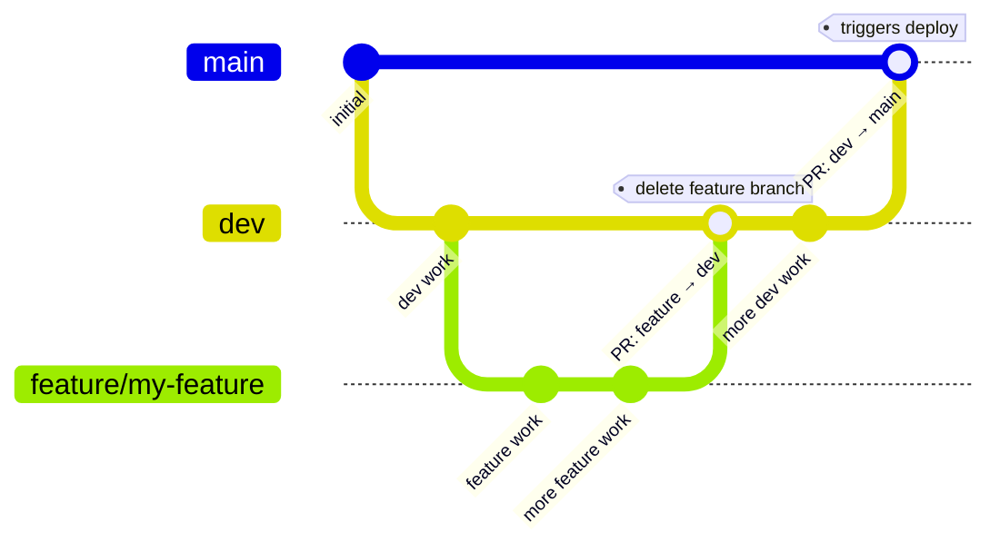

# Development Guide

See [PROJECT_LAYOUT.md](PROJECT_LAYOUT.md) for the full directory tree.

## Live site

Hosted on **GitHub Pages**: <https://ejamer.github.io/hugo-testing/>

Pushing to `main` triggers the GitHub Actions workflow (`.github/workflows/hugo.yml`), which builds with Hugo and deploys automatically.

---

## Local development

Hugo is installed via snap (`/snap/bin/hugo`). Run all commands from the **repo root** unless noted.

```bash
make serve        # dev server with search (preferred)
make build        # quick local build — no minification, no pagefind
make build-prod   # production build — minified + pagefind index
```

> [!TIP]
> `make serve` runs three steps in order: builds the site, generates the search index with Pagefind, then starts the dev server. Using just `hugo server` inside the `fenb-1` folder skips the Pagefind step, so the search overlay will silently fail to load — always use `make serve` when you need a full-featured test.

The site builds in ~100 ms. Open `http://localhost:1313/hugo-testing/` in your browser.

### Environment configuration

`baseURL` is set per environment in `fenb-1/config/`:

| Directory | Environment | `baseURL` | Used by |
|---|---|---|---|
| `config/development/` | `development` | `https://ejamer.github.io/hugo-testing/` | `make serve`, `make build` |
| `config/production/` | `production` | `https://fencingnb.ca/` | `make build-prod` |

Hugo defaults to `production` for the bare `hugo` command and `development` for `hugo server`. `make build` and `make serve` explicitly pass `--environment development` so local builds always use the test URL. Never put `baseURL` in the root `hugo.toml` — it belongs only in these environment files.

---

## Claude Code skills

Git and release workflows are automated as Claude Code skills (invoked with `/fenb-*` in the CLI):

| Skill | What it does |
|---|---|
| `/fenb-commit` | Stage, commit, and push — handles branch checks, feature branch creation, and remote state |
| `/fenb-merge-features` | Discover unmerged feature branches, let user select one, and open a PR into `dev` |
| `/fenb-release` | Production build check, bilingual parity check, and open a PR from `dev` into `main` |

For content-creation skills (`/fenb-new-news`, `/fenb-new-page`, `/fenb-season-rollover`, `/fenb-get-results`), see `README.md`. See `CLAUDE.md` for the full skill list and the `fenb-` prefix rule.

---

## Stack

| Layer | Choice |
|-------|--------|
| Static site generator | [Hugo](https://gohugo.io) v0.161+ (extended) |
| Theme | [Ananke](https://github.com/theNewDynamic/gohugo-theme-ananke) (submodule) |
| CSS | Ten scoped files in `fenb-1/assets/ananke/css/fenb-*.css`, merged by Ananke's `resources.Concat` pipeline |
| i18n | Hugo built-in — English (`en-CA`) · French (`fr-CA`) |
| Content | Markdown in `fenb-1/content/` |
| Structured data | YAML in `fenb-1/data/` (events, clubs, board, programs, policies, hero slides, join URLs) |

---

## Branch strategy

| Branch | Purpose |
|--------|---------|
| `main` | Production — every push triggers a Pages deploy. **Never commit directly to `main`.** |
| `dev` | Permanent development branch. All work lands here first. **Never delete.** |
| `feature/*` | Short-lived branches cut from `dev` for larger features. Delete after the PR into `dev` is merged. |

### Branch structure



### Feature development flow


1. Cut a feature branch from `dev` (or work directly in `dev` for small changes).
2. Develop and test locally.
3. Push the feature branch and open a PR into `dev`. Merge and delete the feature branch.
4. When `dev` is ready to release, open a PR from `dev` into `main`. The Actions job deploys on merge.

---

## Release checklist

Before opening a PR from `dev` into `main`, verify:

- [ ] **On `dev` branch** — confirm `git branch` shows `dev` and `git status` is clean
- [ ] **Remote in sync** — `git fetch origin && git status` shows `dev` is not behind `origin/dev`
- [ ] **Production build passes** — `make build-prod` completes with no errors or warnings
- [ ] **Bilingual parity** — every `.en.md` in `fenb-1/content/` has a matching `.fr.md` (and vice versa)
- [ ] **TODO.md reviewed** — no unchecked items are left addressed but unmarked
- [ ] **No orphan placeholder links** — any new links introduced this cycle point to real pages

After confirming the above, run `/fenb-release` or open the PR manually with:

```bash
gh pr create --base main --head dev --title "Release: <summary>" --body "..."
```

### Search index

Pagefind runs as a post-build step and writes its index to `public/pagefind/`. This directory is **not tracked in git** — regenerate it after every build. The search overlay lazy-loads Pagefind's JS/CSS on first use, so `/pagefind/` must exist before serving.
