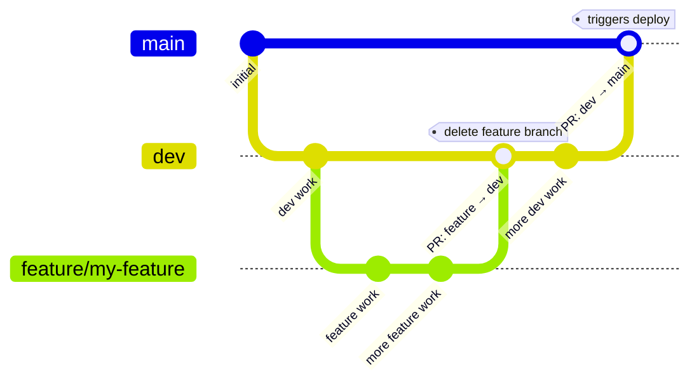
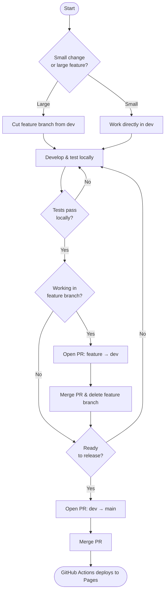

# Development Guide

See [PROJECT_LAYOUT.md](PROJECT_LAYOUT.md) for the full directory tree.

## Live site

Hosted on **GitHub Pages**: <https://ejamer.github.io/hugo-testing/>

Pushing to `main` triggers the GitHub Actions workflow (`.github/workflows/hugo.yml`), which builds with Hugo and deploys automatically.

---

## Local development

Hugo is installed via snap (`/snap/bin/hugo`). Run all commands from the **repo root** unless noted. If Hugo is installed elsewhere, override the path: `make serve HUGO=/usr/local/bin/hugo`.

```bash
make serve        # dev server with search (preferred)
make build        # quick local build — no minification, no pagefind
make build-prod   # production build — minified + pagefind index
```

> [!TIP]
> `make serve` runs three steps in order: builds the site, generates the search index with Pagefind, then starts the dev server. Using just `hugo server` inside the `fenb-1` folder skips the Pagefind step, so the search overlay will silently fail to load — always use `make serve` when you need a full-featured test.

The site builds in ~100 ms. Open `http://localhost:1313/` in your browser.

### Environment configuration

`baseURL` is set per environment in `fenb-1/config/`:

| Directory | Environment | `baseURL` | Used by |
|---|---|---|---|
| `config/development/` | `development` | `https://ejamer.github.io/hugo-testing/` | `make serve`, `make build` |
| `config/production/` | `production` | `https://fenb.ca/` | `make build-prod` |

Hugo defaults to `production` for the bare `hugo` command and `development` for `hugo server`. `make build` and `make serve` explicitly pass `--environment development` so local builds always use the test URL. Never put `baseURL` in the root `hugo.toml` — it belongs only in these environment files.

`make serve` also passes `--baseURL http://localhost:1313/` to override the GitHub Pages subpath (`/hugo-testing/`) at runtime. Without this, root-relative static file links (e.g. `/documents/events/…`) would 404 locally because the path would resolve without the subpath prefix. This flag has no effect on production builds.

---

## Google Analytics

The site uses **Google Analytics 4 (GA4)**, tag `G-BKG2E2SKZF`. The tag ID is stored in `fenb-1/config/production/hugo.toml` under `[services.googleAnalytics]`. Hugo's built-in template emits the gtag.js snippet automatically; it is wired into the Ananke base layout behind a `{{ if hugo.IsProduction }}` guard.

**Analytics only fires on production builds** (`make build-prod`). Local dev (`make serve`, `make build`) never sends tracking data. To change the tag ID, edit `config/production/hugo.toml` only.

To view reports, open [analytics.google.com](https://analytics.google.com) and select the Fencing NB property.

### Access management

GA4 access is granted at the **account** or **property** level — not per data stream. To add or review users:

1. Open [analytics.google.com](https://analytics.google.com) and select the correct property.
2. Click **Admin** (gear icon, bottom left).
3. Under **Account** or **Property**, choose **Access Management**.
4. Click **+** → **Add users**, enter the person's Google account email, and assign a role:

   | Role | Can do |
   |---|---|
   | **Viewer** | View reports only |
   | **Analyst** | Create explorations and custom analyses |
   | **Editor** | Modify settings and configurations |
   | **Administrator** | Full control, including managing other users |

   For most collaborators, **Viewer** or **Analyst** is sufficient.

### Organizational ownership

The GA4 property was created under a personal Google account. For long-term maintainability:

- Add a shared organizational account (e.g. `analytics@fencingnb.ca` or a shared board email) as **Administrator**.
- Add individual volunteers or board members through that account as needed.
- Keep the personal account as a backup admin until the organizational account is confirmed working.

This ensures future volunteers can access analytics without needing the personal account holder's credentials. See the [Google Analytics TODO item](TODO.md) for the outstanding action on this.

---

## Claude Code skills

Git and release workflows are automated as Claude Code skills (invoked with `/fenb-*` in the CLI):

| Skill | What it does |
|---|---|
| `/fenb-git-commit` | Stage, commit, and push — handles branch checks, feature branch creation, and remote state |
| `/fenb-git-merge` | Discover unmerged feature branches, let user select one, and open a PR into `dev` |
| `/fenb-git-release` | Production build check, bilingual parity check, and open a PR from `dev` into `main` |

For content and data skills (`/fenb-content-add-news`, `/fenb-content-add-page`, `/fenb-data-get-results`, `/fenb-data-season-rollover`), see `README.md`. See `CLAUDE.md` for the full skill list and naming convention.

---

## Scripts

Utility scripts live in `scripts/`. They are independent of the Hugo build — run them from the repo root with `python3 scripts/<name>.py`.

### fencingtimelive-results.py

Fetches tournament results from [fencingtimelive.com](https://www.fencingtimelive.com). Requires `--location` to specify the tournament type — this determines what is fetched and how the output is structured.

> **Skill available:** run `/fenb-data-get-results` in Claude Code — it handles parameters, login, tournament selection, and result reporting interactively.

**`--location away`** — NB athletes competed out of province. Scans every event for NB fencer participation (matched against `fenb-1/data/clubs.yaml`) and saves only events where NB athletes appear. Output: `scripts/output/{slug}-{date}.json` with an `events_with_nb_fencers` key.

**`--location hosted`** — tournament held in NB. Fetches full final standings for every finished event and extracts the top-4 medalists (gold, silver, two tied bronze). NB-club filtering is not applied. Output: `scripts/output/{slug}-podiums-{date}.json` with an `events[].podium` key.

**Usage:**

```bash
# Away — search recent CAN tournaments, pick interactively:
python3 scripts/fencingtimelive-results.py --location away

# Away — USA, last 30 days, skip picker:
python3 scripts/fencingtimelive-results.py --location away --country USA --days -2 --select 1

# Hosted — search and pick interactively:
python3 scripts/fencingtimelive-results.py --location hosted

# Hosted — direct tournament ID (bypasses --days limit):
python3 scripts/fencingtimelive-results.py --location hosted --tournament-id 4A78131AF1154821BF95F71B1D4FD913

# Manual cookie instead of browser login:
python3 scripts/fencingtimelive-results.py --location away --cookie "connect.sid=...;AWSALB=..."
```

| Flag | Default | Notes |
|---|---|---|
| `--location` | *(required)* | `hosted` or `away` — determines fetch mode and output structure |
| `--cookie` | *(opens browser)* | Full `Cookie:` header string from DevTools; omit to use browser login |
| `--country` | `CAN` | FIE country code (away mode only) |
| `--days` | `-1` | `-2` last 30 days, `-1` last 10 days, `0` in progress, `1` next 7 days |
| `--tournament-id` | — | Bypass the tournament list; use this hex ID directly (useful for old tournaments) |
| `--list` | — | Print tournament list as JSON and exit (used by skill) |
| `--select N` | — | Skip interactive picker, use tournament N from the list (used by skill) |

**Authentication:** the site uses Google OAuth, which cannot be automated. On first run, system Chrome opens and you complete the Google login normally. The session is saved to `scripts/.browser-profile/` (gitignored) and reused on subsequent runs until it expires.

**Dependencies:** `pip install playwright pyyaml` — no extra browser install needed; the script uses system Chrome.

---

## Stack

| Layer | Choice |
|-------|--------|
| Static site generator | [Hugo](https://gohugo.io) v0.161+ (extended) |
| Theme | [Ananke](https://github.com/gohugo-ananke/ananke) (git submodule — pinned at a specific commit) |
| CSS | Ten scoped files in `fenb-1/assets/ananke/css/fenb-*.css`, merged by Ananke's `resources.Concat` pipeline |
| i18n | Hugo built-in — English (`en-CA`) · French (`fr-CA`) |
| Content | Markdown in `fenb-1/content/` |
| Structured data | YAML in `fenb-1/data/` (events, clubs, board, programs, policies, hero slides, join URLs) |

---

## Ananke theme submodule

The Ananke theme lives in `fenb-1/themes/ananke/` and is managed as a git submodule. A submodule is a pinned reference to a specific commit in another repository — the repo stores only the commit hash, not the files themselves. The files are present locally but not tracked by this repo.

**After a fresh clone**, populate the theme files:
```bash
git submodule update --init
```

**To update Ananke** to a newer version:
```bash
git submodule update --remote fenb-1/themes/ananke  # fetch and checkout latest main
make build                                           # verify the build still works
git add fenb-1/themes/ananke                        # stage the updated commit hash
git commit -m "Update Ananke theme to <new-hash>"
```

The commit in `fenb-1/themes/ananke` after `git add` will be the new pinned version. Always verify the build before committing an update — Ananke's CSS pipeline (`GetMainCSS.html`) is load-bearing for the site's stylesheet.

**Checking the current pinned version:**
```bash
git submodule status               # shows pinned hash
cd fenb-1/themes/ananke && git log --oneline -3  # shows what that commit is
```

---

## Branch strategy

| Branch | Purpose |
|--------|---------|
| `main` | Production — every push triggers a Pages deploy. **Never commit directly to `main`.** |
| `dev` | Permanent development branch. All work lands here first. **Never delete.** |
| `feature/*` | Short-lived branches cut from `dev` for larger features. Delete after the PR into `dev` is merged. |

### Branch structure



### Feature development flow



1. Cut a feature branch from `dev` (or work directly in `dev` for small changes).
2. Develop and test locally.
3. Push the feature branch and open a PR into `dev`. Merge and delete the feature branch.
4. When `dev` is ready to release, open a PR from `dev` into `main`. The Actions job deploys on merge.

---

## Release checklist

Before opening a PR from `dev` into `main`, verify:

- [ ] **On `dev` branch** — confirm `git branch` shows `dev` and `git status` is clean
- [ ] **Remote in sync** — `git fetch origin && git status` shows `dev` is not behind `origin/dev`
- [ ] **Production build passes** — `make build-prod` completes with no errors or warnings
- [ ] **Bilingual parity** — every `.en.md` in `fenb-1/content/` has a matching `.fr.md` (and vice versa)
- [ ] **TODO.md reviewed** — no unchecked items are left addressed but unmarked
- [ ] **No orphan placeholder links** — any new links introduced this cycle point to real pages

After confirming the above, run `/fenb-git-release` or open the PR manually with:

```bash
gh pr create --base main --head dev --title "Release: <summary>" --body "..."
```

### Release versioning

Releases may optionally be tagged with a semver version (`vMAJOR.MINOR.PATCH`). The `/fenb-git-release` skill prompts for this after each successful merge. Tagging is optional — during rapid development, most merges are untagged.

| Level | When to use | Example trigger |
|---|---|---|
| **Major** | Major redesign or structural restructure | Full site redesign, navigation overhaul |
| **Minor** | New section or feature added | New content type, new page, new interactive feature |
| **Patch** | Content update or fix | News article, event update, copy correction |

`/fenb-git-release` also writes `fenb-1/static/version.json` and commits it to `dev` as part of every release. It records the version, timestamp, author, PR URL, and commit count. Check the currently deployed version with:

```bash
curl https://fenb.ca/version.json
```

### version.json fields

`/fenb-git-release` writes `fenb-1/static/version.json` and commits it to `dev`. Do not edit it manually. Fields:

| Field | Value |
|---|---|
| `version` | Semver tag (e.g. `"v0.1.0"`) if tagged; otherwise `"<last-tag>-dev"` |
| `released_at` | UTC timestamp of the release |
| `released_by` | Name and anonymized email of the releaser |
| `pr` | URL of the release PR |
| `commits_since_tag` | Cumulative commit count since the last semver tag (grows between tags; reset only when a new tag is applied) |

---

## `gh` CLI quirks

### TTY and output

All `gh` commands that produce output (lists, JSON, status) must be wrapped with `script -q -c "..." /dev/null` to get visible output in non-TTY environments. Without the wrapper, commands silently return nothing — including `--json` variants.

```bash
script -q -c "gh pr list --state open" /dev/null
script -q -c "gh pr merge 33 --merge --body ''" /dev/null
```

Use `--input` for complex `gh api` payloads that contain special characters.

### `gh pr merge` requires an explicit PR number

Never run `gh pr merge` without specifying a PR number. Without one, `gh` resolves to the PR associated with the *current branch* — if you're on `dev`, it finds the most recent `dev→main` PR and can delete `dev`.

Always capture the PR number from `gh pr create` output and pass it explicitly:

```bash
gh pr merge $PR_NUMBER --merge --delete-branch
```

Extract `$PR_NUMBER` from the URL returned by `gh pr create` (the integer at the end).

---

### Search index

Pagefind runs as a post-build step and writes its index to `public/pagefind/`. This directory is **not tracked in git** — regenerate it after every build. The search overlay lazy-loads Pagefind's JS/CSS on first use, so `/pagefind/` must exist before serving.
